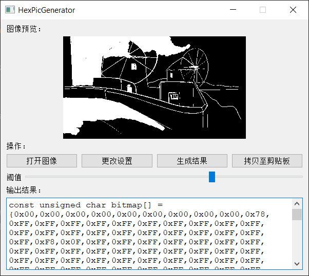

# Arduino 图像二值化与取模工具
## 介绍
Arduino 显示库辅助小工具。

该工具可导入图片，设定灰度阈值对图像进行二值化，并将二值化后的图像转换为Arduino多种显示库（Adafruit_SSD1306, u8g2等）中支持的十六进制数组格式。

## 使用

单击打开图像按钮导入图片，使用下方阈值滑块调节阈值并在上方预览效果，单击“生成结果”进行图像转换，单击“拷贝至剪贴板”将转换后的内容拷贝到系统剪贴板。

## 注意
目前工作方式需要图像**在宽度上为8的倍数**。在后续版本中会进行修复。

## 更新计划
1. 对图像宽度非8的倍数进行强制裁剪；
2. 增加高低位翻转等功能；
3. 增加批量处理功能；
4. 优化界面。

## 关于
本程序由多年前在进行Arduino项目制作时使用的辅助脚本增加GUI改编而成。目前功能较为单一。欢迎使用并提出意见。望能起到帮助。